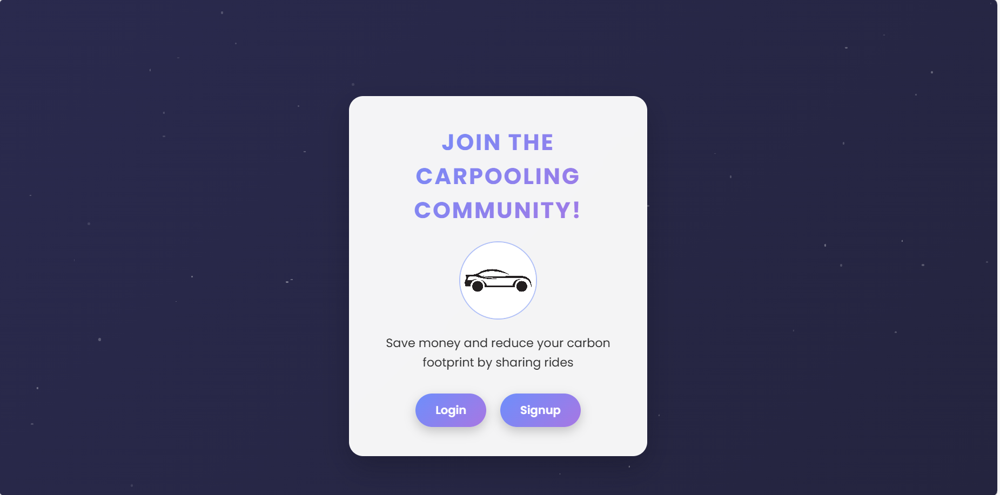
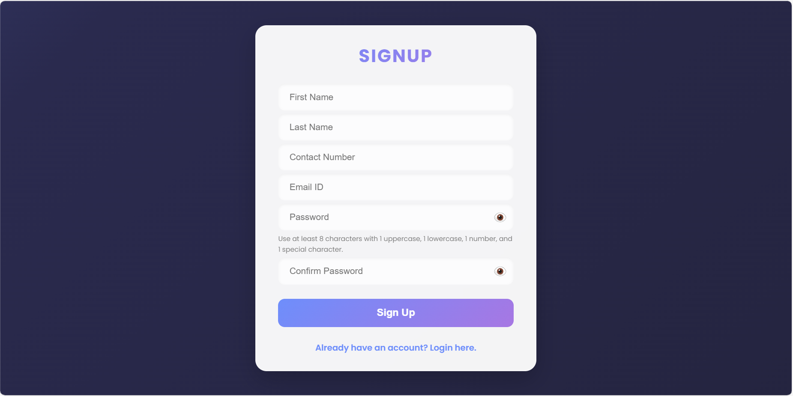
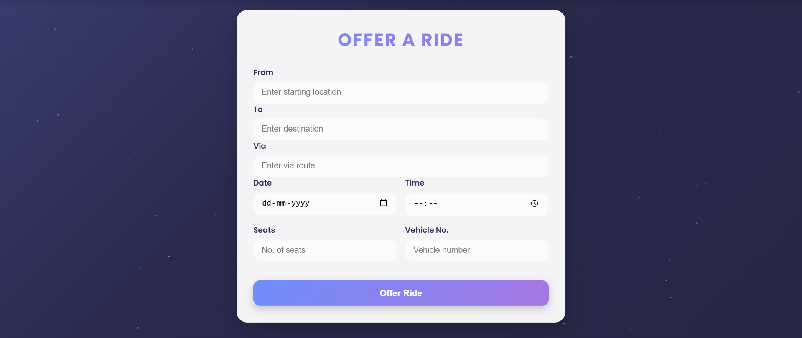
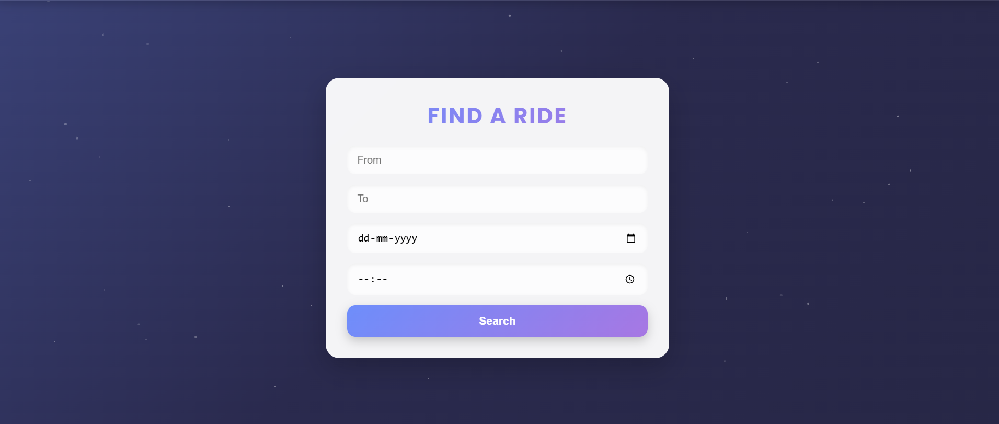

#  Car Pooling Web Application

A full-stack Flask-based web application that connects drivers and passengers, enabling users to offer and find rides. This system promotes efficient car usage and makes travel more affordable and environmentally friendly.


##  Screenshots

| Landing Page | Signup/Login | Offer Ride | Find Ride |
|--------------|--------------|------------|-----------|
|  |  |  |  |


---

## 🛠 Features

- **User Authentication**: Register and login securely
- **Offer Ride**: Post rides with route, date, time, and vehicle details
- **Find Rides**: Search for available rides by route and date
- **Profile Management**: Edit profile, update password
- **Session-based Auth**: Secure session tracking with Flask

---

##  Technologies Used

- **Frontend**: HTML5, CSS3, JavaScript, Jinja2
- **Backend**: Python, Flask
- **Database**: SQLite
- **Other**: Flask-Session, Subprocess, Bootstrap (optional)

---


## 🧪 Setup Instructions

### 1. Clone the Repository

```bash
git clone https://github.com/sanjai002/Car-Pooling.git
cd Car-Pooling
```

### 2. Install Flask

```bash
pip install flask flask-session
```

### 3. Run Database Script

```bash
python DBScript.py
```

### 4. Run the Application

```bash
python app.py
```
